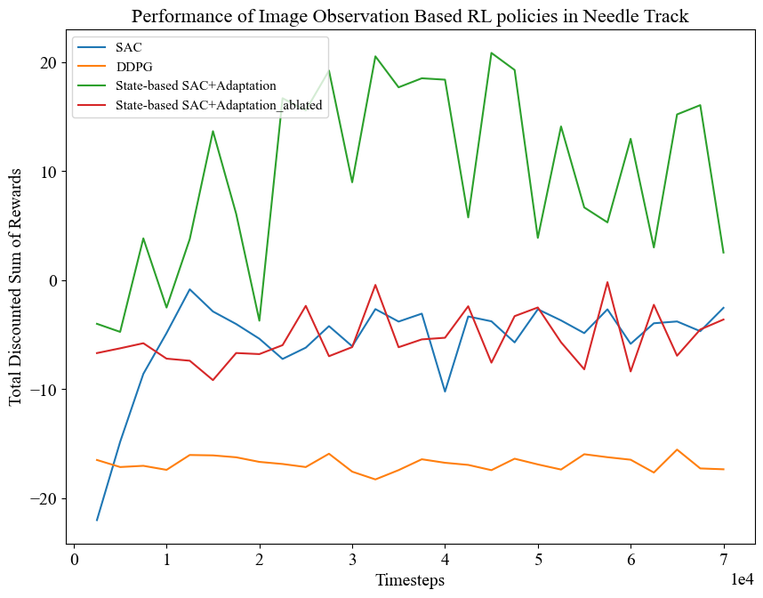

# CS234_NeedleManipulation
The codebase for Stanford's CS234 Final Project on Needle Manipulation in Surgical Robot Environment.
It contains necessary files to conduct evaluations of multiple different environments on NeedleReach, NeedleTrack and NeedleGrasp Task.
It contains modifications to the OpenAI gym that makes it compatible with RMA framework's training process.
It is based on SurRoL, an open-source RL framework for surgical robotic learning available at https://github.com/med-air/SurRoL.

To run state-based SAC policy on needle reaching task:
```
python train.py
```

To run adaptation module training on needle reaching task:
```
python train_adapt.py
```

To run End2End Visual Policy training on needle reaching task:
First swap out the psm_env.py and the surrol_env.py with versions in the same subdirectory but with ImageObs ending.
Then execute
```
python train_end2endvisual.py
```

To run adaptation module training on needle tracking task:
First replace the psm_env.py and surrol_env.py with versions in the same subdirectory but with needletrack and adapt_track ending respectively.
Then execute
```
python train_adapt_needletrack.py
```

To run state-based DDPG policy on needle tracking task:
First replace the psm_env.py and surrol_env.py with versions in the same subdirectory but with needletrack ending.
Then execute
```
python train_statebased_needletrack.py
```

To run End2End Visual DDPG policy on needle tracking task:
First replace the psm_env.py and surrol_env.py with versions in the same subdirectory but with ImageObs and needletrack ending respectively.
Then execute
```
python train_statebased_needletrack.py
```

## Needle Tracking Adaptation Result (Updated)
<p align="center">
   
</p>
<p align="center">
   
</p>
The adaptation module in the needle tracking task is the same as in needle reaching and the same end2end visual SAC, DDPG baselines were used. In addition to the SAC, DDPG, and the two-stage framework, we also conduct an ablation study on the two-stage policy framework. Specifically, we explore the effects of using a fixed goal for the entire episode, derived from the inferred goal out of the adaptation module at the starting frame of the 50-timestep episode. All four methods are trained for 70k timesteps.

It can be seen the adaptation module achieves **100%** success, while other end-to-end image-based methods struggle to achieve higher than 20% success rate. The reward of state-based SAC + Adaptation achieves 21.54, which is **comparable to oracle SAC policy**. Moreover, the vast difference in performance between policy with adaptation module and the ablated policy (without updating the adaptation module) showcases the necessity of updating the inputs on different time steps.


